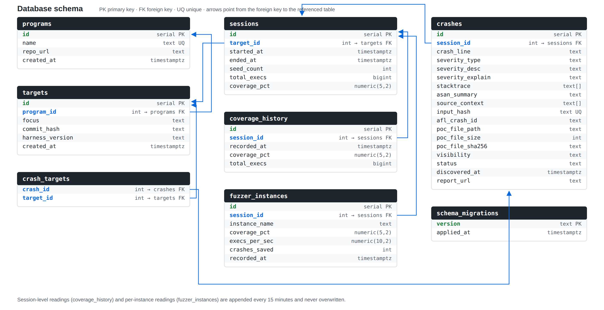
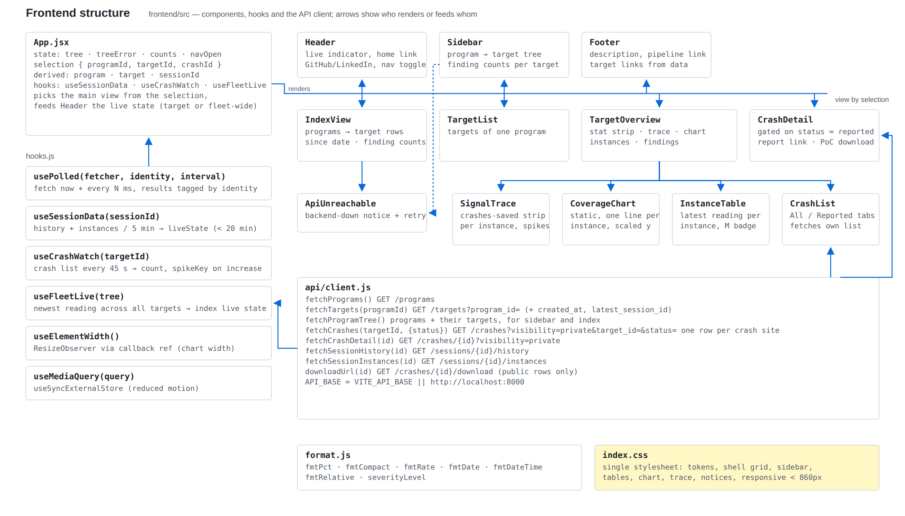

# Codebase guide

A component-by-component description of how the pipeline is built. The
[root README](../README.md) gives the overview; this document goes one level
deeper into each part, in the order data flows through the system.

Diagrams (regenerate with `python3 docs/diagrams/generate_diagrams.py`):

- 
- 

## 1. Fuzzing cluster — `Dockerfile`, `docker-compose.yml`

The root `Dockerfile` builds the fuzzing image: it fetches the target
library, compiles it with AFL++ instrumentation (`afl-cc` / `afl-c++`) and
links the harness source from `harness/` against that instrumented build as
`/fuzzing/harness`. `docker-compose.yml` runs four
instances of that image plus the database and the API:

| Service | Role |
| --- | --- |
| `fuzzer0` | AFL++ master (`-M fuzzer0`) |
| `fuzzer1`–`fuzzer3` | AFL++ secondaries (`-S fuzzerN`), started a few seconds after the master |
| `postgres` | PostgreSQL 16, data on `/data/postgres`, published on `127.0.0.1:5432` only |
| `api` | FastAPI service built from `api/`, `/data` mounted for PoC downloads, published on `127.0.0.1:8000` |

All fuzzers share the host's `/data` volume:

| Path | Contents |
| --- | --- |
| `/data/afl-output/` | AFL++ output directory (queue, crashes, stats per instance) |
| `/data/<seeds>/` | the seed corpus passed with `-i` |
| `/data/poc_archive/<focus>/` | archived crashing inputs, one file per finding |
| `/data/backups/` | database dumps and archive tarballs taken before maintenance |
| `/data/run_triage.sh` | host-side cron wrapper (not in the repository) |

Everything that identifies the target — the harness, the seed directory, the
archive sub-directory — lives in this layer. The rest of the system only
knows *programs* and *targets* from the database.

## 2. Statistics collector — `triage/update_session_stats.py`

Invoked by cron as `update_session_stats.py <target_id>`.

1. `get_whatsup_output()` runs `afl-whatsup /data/afl-output` inside the
   master container.
2. `parse_coverage_pct()` / `parse_total_execs()` read the *Summary stats*
   block ("Coverage reached", "Total execs", normalising "N millions, M
   thousands" into an integer).
3. `parse_instances()` splits the *Individual fuzzers* section on the
   `>>> … instance: <name> … <<<` headers and, per block, extracts coverage,
   lifetime execs/s and crashes saved. Blocks without those fields (an
   instance that is "dead or running remotely") are skipped.
4. `get_or_create_session()` picks the target's most recent `sessions` row
   or creates one.
5. `record_session_stats()` updates the session's `coverage_pct` /
   `total_execs` **and** appends a `coverage_history` row;
   `record_instance_stats()` appends one `fuzzer_instances` row per parsed
   instance. Nothing is ever overwritten, which is what makes the coverage
   charts possible.

Connection settings: `127.0.0.1:5432`, database `fuzzer_db`, user `fuzzer`,
password from `FUZZER_DB_PASSWORD`.

## 3. Crash ingestion — `triage/triage.py`

Invoked by cron as `triage.py <casr_output_dir> <session_id>` after CASR has
been run over the AFL++ crash directory.

- `parse_casrep()` loads each `.casrep` JSON report; the crashing input is
  the sibling file without the `.casrep` suffix (`find_original_crash_file()`).
- `crash_site()` / `compute_input_hash()` derive the dedup key: the SHA-256
  of `CrashLine` (`file:line:col`), falling back to the top stack frame with
  hexadecimal addresses stripped. One finding per crash site is the intended
  granularity — a later crash at a known location is a repeat, not a new
  finding.
- `insert_crash()` writes the row (`severity_*` from `CrashSeverity`, the
  `Stacktrace` and `Source` arrays, the `SUMMARY:` line of the sanitizer
  report, PoC size and SHA-256) with `ON CONFLICT (input_hash) DO NOTHING`,
  so repeats are dropped without an error. New rows start as
  `status = 'new'`, `visibility = 'private'`.
- `archive_poc()` copies the input to `POC_ARCHIVE_DIR` as
  `crash_<id>.<ext>` and the row's `poc_file_path` is updated to that
  permanent location.

`POC_ARCHIVE_DIR` is a constant at the top of the file and is target-specific
(one sub-directory per fuzzed format); change it when the target changes.

## 4. Database — `db/`

`db/migrations/NNN_*.sql` are applied in order by `db/run_migrations.py`,
which creates `schema_migrations` on first run and skips versions already
recorded. It reads `DB_HOST`, `DB_PORT` and `FUZZER_DB_PASSWORD` from the
environment so the same command works on the host, through an SSH tunnel, or
against a scratch database.

Tables (see the schema diagram):

- `programs` — the library under test (`name` unique, `repo_url`).
- `targets` — one per fuzzed input format / harness of a program
  (`focus`, `harness_version`, `created_at`).
- `sessions` — one fuzzing run of a target; the latest session is what the
  API and collectors work with.
- `coverage_history` — session-level `coverage_pct` / `total_execs` per
  reading.
- `fuzzer_instances` — per-instance `coverage_pct`, `execs_per_sec`,
  `crashes_saved` per reading; `instance_name` `fuzzer0` is the master.
- `crashes` — one row per finding; `input_hash` is unique; `status`
  (`new` → `reported`), `visibility` (`private` → `public`) and `report_url`
  drive disclosure.
- `crash_targets` — reserved link table between findings and targets (not
  populated by the current pipeline).
- `schema_migrations` — applied versions.

`db/archive/` keeps dated one-off maintenance scripts that were run once
against production (moving PoC paths, re-keying and removing duplicates).
They document what was done and are not meant to run again.

## 5. API — `api/main.py`

FastAPI + `psycopg2`, one connection per request, `RealDictCursor` so rows
serialise directly to JSON. CORS allows `GET` from the Vite dev origins only.

| Endpoint | Behaviour |
| --- | --- |
| `GET /programs` | all programs, by name |
| `GET /targets?program_id=` | targets with `created_at` and `latest_session_id` — a correlated subquery for the newest session of each target, which is how the frontend reaches the session-keyed endpoints |
| `GET /crashes` | `DISTINCT ON (crash_line)` keeping the earliest finding per site, then ordered newest-first; `visibility=private` returns every site (admin view), otherwise only `public`; optional `status` and `target_id` filters (the latter joins through `sessions` → `targets`) |
| `GET /crashes/{id}` | full row; `visibility=private` unlocks non-public rows, otherwise 403 |
| `GET /crashes/{id}/download` | `FileResponse` of `poc_file_path` for `public` rows; 403 if not public, 410 if the file is missing |
| `GET /sessions/{id}/history` | `coverage_history` rows, oldest first (404 for an unknown session) |
| `GET /sessions/{id}/instances` | `fuzzer_instances` rows, oldest first |
| `PATCH /crashes/{id}/status` | operator-only status change (`new`/`triaged`/`reported`/`duplicate`); not reachable from the site |

Configuration: `DB_HOST` (default `postgres`), `DB_PORT`, `FUZZER_DB_PASSWORD`.

## 6. Frontend — `frontend/`

React 19 + Vite, one stylesheet, no router: the current page is derived from
a single `selection` object in `App.jsx`.

### State and data flow

- `App.jsx` loads the program → target tree once (`fetchProgramTree`),
  retrying every 8 s while the API is unreachable, and keeps
  `selection = { programId, targetId, crashId }`. From the selection it
  derives `program`, `target` and `sessionId = target.latest_session_id`.
- `useSessionData(sessionId)` polls `/sessions/{id}/history` and
  `/instances` every 5 minutes and derives `liveState`: **live** if the
  newest `recorded_at` is less than 20 minutes older than the time of the
  poll, otherwise **closed**; `unknown` when the session has no readings.
- `useCrashWatch(targetId)` polls the target's finding list every 45 s and
  increments `spikeKey` when the count grows — the trigger for the trace
  spike and for refreshing the visible list.
- `useFleetLive(tree)` does the same live/closed derivation across every
  target's latest session, for the header when nothing is selected.
- `usePolled()` underlies the three hooks: results are tagged with the
  identity they were fetched for, so changing target reads as "loading"
  without a synchronous reset, and late responses for an old identity are
  ignored.
- Finding counts for the index and sidebar come from one `/crashes` request
  per target (`fetchTargetCounts`), refreshed when `spikeKey` changes.

### Components

| Component | Responsibility |
| --- | --- |
| `Header` | title (returns to the index), subtitle, live indicator (target or fleet-wide), GitHub/LinkedIn links, mobile nav toggle |
| `Sidebar` | always-visible program → target tree with finding counts; a slide-in drawer under 860 px |
| `Footer` | project blurb, pipeline link, one link per program's repository |
| `IndexView` | landing page: programs and their targets with start date and counts |
| `TargetList` | targets of one program |
| `TargetOverview` | eyebrow + title with the `SignalTrace` strip beside it, stat strip (coverage, total execs, findings, reported), `CoverageChart`, `InstanceTable`, `CrashList` |
| `SignalTrace` | compact SVG strip: the selected instance's `crashes_saved` history as a dashed line (master by default, chips to switch), a transient spike drawn on `spikeKey`, flat when closed; geometry is written to the DOM from a `requestAnimationFrame` loop, not through React state |
| `CoverageChart` | static SVG line chart, one line per instance from `/instances` (falls back to session history), y-axis scaled to the visible data's own range with padding and nice ticks, legend toggles instances |
| `InstanceTable` | latest reading per instance; `fuzzer0` marked as master |
| `CrashList` | All / Reported tabs (the latter uses `?status=reported`), one row per finding with severity dot, status pill and date |
| `CrashDetail` | badges and key facts for every finding; stack trace, source context (crash line highlighted), sanitizer summary and PoC download only when `status === "reported"`; download only when also `public`; shows `report_url` |
| `ApiUnreachable` | notice with retry, shown in place of the index and in the sidebar while the API cannot be reached |

`format.js` holds number/date helpers; `index.css` holds the design tokens
(dark palette, IBM Plex Sans/Mono), the shell grid, and every component's
styles. Lint runs the React Compiler hook rules, which is why state is only
ever set in callbacks and effects never call `setState` synchronously.

### Disclosure gating

The backend decides what exists (`visibility`) and the frontend decides
what to render (`status`): an unreported finding shows only its location,
severity and assessment behind a "technical detail withheld" panel, whatever
its visibility. The site has no controls that change data.

## 7. Deployment — `.github/workflows/deploy.yml`

On every push to `main`, GitHub Actions connects to the fuzzing host over SSH
(`ORACLE_SSH_KEY` secret), pulls the repository, runs `docker compose build`
and recreates only the `api` service. The fuzzer containers are never
recreated by a deploy so a running campaign is not interrupted; the triage
scripts are picked up by the next cron run straight from the updated
checkout.

## 8. Adding a target or a program

1. Build/adjust the harness and seed corpus, point `docker-compose.yml` at
   the seeds and set `POC_ARCHIVE_DIR` in `triage/triage.py`.
2. `INSERT INTO programs …` (once per library) and `INSERT INTO targets …`
   (`program_id`, `focus`, `harness_version`).
3. Make the cron wrapper call `update_session_stats.py` with the new
   target id; the first run creates the session.
4. Nothing changes in `api/` or `frontend/`: the new program/target appears
   in the sidebar, index and footer, and its coverage, instances and findings
   are served through the same endpoints.
