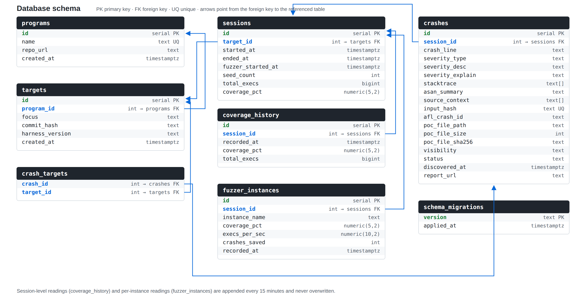
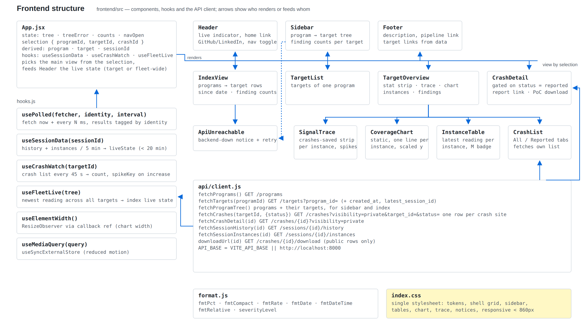

# Codebase guide

A component-by-component description of how the pipeline is built. The
[root README](../README.md) gives the overview; this document goes one level
deeper into each part, in the order data flows through the system.

Diagrams (regenerate with `python3 docs/diagrams/generate_diagrams.py`):

- 
- 

## 1. Fuzzing cluster — `Dockerfile`, `docker-compose.yml`

The root `Dockerfile` builds the fuzzing image: it fetches the target
library, compiles it with AFL++ instrumentation (`afl-cc` / `afl-c++`) and
links the harness source from `harness/` against that instrumented build as
`/fuzzing/harness`. `docker-compose.yml` runs four
instances of that image plus the database and the API:

| Service | Role |
| --- | --- |
| `fuzzer0` | AFL++ master (`-M fuzzer0`) |
| `fuzzer1`–`fuzzer3` | AFL++ secondaries (`-S fuzzerN`), started a few seconds after the master |
| `postgres` | PostgreSQL 16, data on `/data/postgres`, published on `127.0.0.1:5432` only |
| `api` | FastAPI service built from `api/`, `/data` mounted for PoC downloads, published on `127.0.0.1:8000` |

All fuzzers share the host's `/data` volume:

| Path | Contents |
| --- | --- |
| `/data/afl-output/` | AFL++ output directory (queue, crashes, stats per instance) |
| `/data/<seeds>/` | the seed corpus passed with `-i` |
| `/data/poc_archive/<focus>/` | archived crashing inputs, one file per finding |
| `/data/backups/` | database dumps and archive tarballs taken before maintenance |

Secrets and host-specific overrides live in the repo-root `.env` (gitignored,
not in version control; see `.env.example` for the keys) — the same file
`docker compose` and `triage/run_triage.sh` both read.

Everything that identifies the target — the harness, the seed directory, the
archive sub-directory — lives in this layer. The rest of the system only
knows *programs* and *targets* from the database.

## 2. Statistics collector — `triage/update_session_stats.py`

Invoked by cron as `update_session_stats.py <target_id>`.

1. `get_whatsup_output()` runs `afl-whatsup /data/afl-output` inside the
   master container.
2. `parse_coverage_pct()` / `parse_total_execs()` read the *Summary stats*
   block ("Coverage reached", "Total execs", normalising "N millions, M
   thousands" into an integer).
3. `parse_instances()` splits the *Individual fuzzers* section on the
   `>>> … instance: <name> … <<<` headers and, per block, extracts coverage,
   lifetime execs/s and crashes saved. Blocks without those fields (an
   instance that is "dead or running remotely") are skipped.
4. `get_or_create_session()` picks the target's most recent `sessions` row
   or creates one, and reconciles it with the run in progress using the
   master's `start_time` from `fuzzer_stats` (stored as
   `sessions.fuzzer_started_at`): same start → the run continues; a
   different start → the fuzzers were restarted for the same target, so the
   session's `coverage_history` and `fuzzer_instances` rows are deleted and
   its clock reset, while its `crashes` stay attached (a repeat of an already
   recorded site is not a new finding).
5. `record_session_stats()` updates the session's `coverage_pct` /
   `total_execs` **and** appends a `coverage_history` row;
   `record_instance_stats()` appends one `fuzzer_instances` row per parsed
   instance. Within a run nothing is ever overwritten, which is what makes
   the coverage charts possible.

Before any of that, `master_running()` checks the master container with
`docker inspect`. When it is not running the script only sets `ended_at`
on the target's latest session and exits 0: the readings stay in the
database, so the site keeps showing the last run's charts after the fuzzer
containers have been stopped.

Connection settings: `127.0.0.1:5432`, database `fuzzer_db`, user `fuzzer`,
password from `FUZZER_DB_PASSWORD`.

## 3. Crash ingestion — `triage/triage.py`

Invoked by cron as `triage.py <casr_output_dir> <session_id>` after CASR has
been run over the AFL++ crash directory.

- `parse_casrep()` loads each `.casrep` JSON report; the crashing input is
  the sibling file without the `.casrep` suffix (`find_original_crash_file()`).
- `symbolize_report()` resolves `CrashLine` / `Stacktrace` in place first,
  via `triage/symbolize.py`, for reports where ASan failed to fork
  `llvm-symbolizer` at crash time and left them as raw `<module>+0x<offset>`
  addresses — offline, against the harness inside `CASR_IMAGE` (the exact
  image CASR itself just ran the crashes through), gated on a BuildId match
  so it can never resolve against the wrong binary. See `triage/README.md`
  for the full explanation and `triage/resymbolize_existing.py`, the one-off
  operator script that applies the same fix to rows already in the database.
- `crash_site()` / `compute_input_hash()` derive the dedup key: the SHA-256
  of `CrashLine` (`file:line:col`), falling back to the top stack frame with
  hexadecimal addresses stripped. One finding per crash site is the intended
  granularity — a later crash at a known location is a repeat, not a new
  finding.
- `insert_crash()` writes the row (`severity_*` from `CrashSeverity`, the
  `Stacktrace` and `Source` arrays, the `SUMMARY:` line of the sanitizer
  report, PoC size and SHA-256) with `ON CONFLICT (input_hash) DO NOTHING`,
  so repeats are dropped without an error. New rows start as
  `status = 'new'`, `visibility = 'private'`.
- `session_focus()` looks up the session's target `focus`;
  `archive_poc()` copies the input to
  `<POC_ARCHIVE_ROOT>/<focus>/crash_<id>.<focus>` and the row's
  `poc_file_path` is updated to that permanent location. Nothing in the
  script names a specific target.

`triage/run_triage.sh` is the cron entry point that ties the scripts
together: it selects the active target (newest `targets` row unless
`TARGET_ID` is set in the repo-root `.env`), runs the collector, runs CASR
in `CASR_IMAGE` — the AFL master container's current image, resolved fresh
each run via `docker inspect`, falling back to the `FUZZER_IMAGE` tag only
if that can't be resolved — and then the ingestion, passing that same
`CASR_IMAGE` through so offline symbolization always runs against the exact
image CASR just used.

## 4. Database — `db/`

`db/migrations/NNN_*.sql` are applied in order by `db/run_migrations.py`,
which creates `schema_migrations` on first run and skips versions already
recorded. It reads `DB_HOST`, `DB_PORT` and `FUZZER_DB_PASSWORD` from the
environment so the same command works on the host, through an SSH tunnel, or
against a scratch database.

Tables (see the schema diagram):

- `programs` — the library under test (`name` unique, `repo_url`).
- `targets` — one per fuzzed input format / harness of a program
  (`focus`, `harness_version`, `created_at`).
- `sessions` — the current fuzzing run of a target (`started_at`,
  `fuzzer_started_at` = the AFL++ master's start time, `ended_at` set by the
  collector when the master container is gone); the latest session is what
  the API and collectors work with, and a restart for the same target resets
  its readings in place rather than creating a new row.
- `coverage_history` — session-level `coverage_pct` / `total_execs` per
  reading.
- `fuzzer_instances` — per-instance `coverage_pct`, `execs_per_sec`,
  `crashes_saved` per reading; `instance_name` `fuzzer0` is the master.
- `crashes` — one row per finding; `input_hash` is unique; `status`
  (`new` → `reported`), `visibility` (`private` → `public`) and `report_url`
  drive disclosure.
- `crash_targets` — reserved link table between findings and targets (not
  populated by the current pipeline).
- `schema_migrations` — applied versions.

`db/archive/` keeps dated one-off maintenance scripts that were run once
against production (moving PoC paths, re-keying and removing duplicates).
They document what was done and are not meant to run again.

## 5. API — `api/main.py`

FastAPI + `psycopg2`, one connection per request, `RealDictCursor` so rows
serialise directly to JSON. CORS allows `GET` from the Vite dev origins only.

| Endpoint | Behaviour |
| --- | --- |
| `GET /programs` | all programs, by name |
| `GET /targets?program_id=` | targets with `created_at` and the state of each target's newest session: `latest_session_id` (how the frontend reaches the session-keyed endpoints), `latest_session_started_at`, `latest_session_ended_at`, `latest_reading_at` and `running` — true while `ended_at` is unset and the newest `coverage_history` reading is younger than `RUNNING_WINDOW` (20 minutes) |
| `GET /sessions/{id}` | the session row plus the same `latest_reading_at` / `running` fields |
| `GET /crashes` | `DISTINCT ON (crash_line)` keeping the earliest finding per site, then ordered newest-first; optional `status` and `target_id` filters (the latter joins through `sessions` → `targets`). In `PUBLIC_MODE` every site is listed regardless of visibility (the `visibility` query param is ignored) but a non-public row is redacted — see "Disclosure gating" below. Outside `PUBLIC_MODE`, `visibility=private` returns every site unredacted (admin view), otherwise only `public` ones |
| `GET /crashes/{id}` | full row, unless `PUBLIC_MODE`: a non-public finding then returns 200 with the same redacted shape as the list (not 404 — existence is already visible there) and `visibility=private` is ignored. Outside `PUBLIC_MODE`, `visibility=private` unlocks non-public rows, otherwise 403 |
| `GET /crashes/{id}/download` | `FileResponse` of `poc_file_path` for `public` rows; if not public, 404 in `PUBLIC_MODE` (same reasoning as above) or 403 otherwise; 410 if the file is missing |
| `GET /sessions/{id}/history` | `coverage_history` rows, oldest first (404 for an unknown session) |
| `GET /sessions/{id}/instances` | `fuzzer_instances` rows, oldest first |
| `PATCH /crashes/{id}/status` | operator-only status change (`new`/`triaged`/`reported`/`duplicate`); not reachable from the site; disabled (404) in `PUBLIC_MODE` |

Configuration: `DB_HOST` (default `postgres`), `DB_PORT`, `FUZZER_DB_PASSWORD`,
`PUBLIC_MODE` (see below).

## 6. Frontend — `frontend/`

React 19 + Vite, one stylesheet, no router: the current page is derived from
a single `selection` object in `App.jsx`.

### State and data flow

- `App.jsx` loads the program → target tree once (`fetchProgramTree`),
  retrying every 8 s while the API is unreachable, and keeps
  `selection = { programId, targetId, crashId }`. From the selection it
  derives `program`, `target` and `sessionId = target.latest_session_id`.
- `useFleetLive(tree)` polls `/targets` every 5 minutes and turns the
  latest-session fields into one entry per target (`running`, `latestAt`,
  `startedAt`, `endedAt`). Fleet-wide `liveState` is **live** when any
  target is running, **idle** when none is, `unknown` before any reading
  exists.
- `useSessionData(sessionId, run)` polls `/sessions/{id}/history` and
  `/instances` every 5 minutes; `liveState` comes from the target's
  `useFleetLive` entry (**live** / **closed**), falling back to the reading
  age (newest `recorded_at` less than 20 minutes older than the poll) until
  that has loaded.
- `useCrashWatch(targetId)` polls the target's finding list every 45 s and
  increments `spikeKey` when the count grows — the trigger for the trace
  spike and for refreshing the visible list.
- `usePolled()` underlies the three hooks: results are tagged with the
  identity they were fetched for, so changing target reads as "loading"
  without a synchronous reset, and late responses for an old identity are
  ignored.
- Finding counts for the index and sidebar come from one `/crashes` request
  per target (`fetchTargetCounts`), refreshed when `spikeKey` changes.

### Components

| Component | Responsibility |
| --- | --- |
| `Header` | title (returns to the index), subtitle, live indicator — the selected target's run (Live / Closed) or, on the index, whether anything is running (Live / grey Not running) — with a hover/focus popover listing every target's run state, GitHub/LinkedIn links, mobile nav toggle |
| `Sidebar` | always-visible program → target tree with finding counts; a slide-in drawer under 860 px |
| `Footer` | project blurb, pipeline link, one link per program's repository |
| `IndexView` | landing page: programs and their targets with start date and counts |
| `TargetList` | targets of one program |
| `TargetOverview` | eyebrow + title with the `SignalTrace` strip beside it, stat strip (coverage, total execs, findings, reported), `CoverageChart` (with a "run stopped" note once the fuzzers are gone), `InstanceTable`, `CrashList` |
| `SignalTrace` | compact SVG strip: the selected instance's `crashes_saved` history as a dashed line (master by default, chips to switch), a transient spike drawn on `spikeKey`, flat when closed; geometry is written to the DOM from a `requestAnimationFrame` loop, not through React state |
| `CoverageChart` | static SVG line chart, one line per instance from `/instances` (falls back to session history), y-axis scaled to the visible data's own range with padding and nice ticks, legend toggles instances |
| `InstanceTable` | latest reading per instance; `fuzzer0` marked as master |
| `CrashList` | All / Reported tabs (the latter uses `?status=reported`), one row per finding with severity dot, status pill and date; a `withheld` row shows a neutral dot and "detail withheld" in place of the real `crash_line` |
| `CrashDetail` | badges and key facts for every finding; stack trace, source context (crash line highlighted), sanitizer summary and PoC download only when the API's `withheld` flag is false; download only when also `public`; shows `report_url`; a withheld finding shows a "withheld" severity badge instead of a real one |
| `ApiUnreachable` | notice with retry, shown in place of the index and in the sidebar while the API cannot be reached |

`format.js` holds number/date helpers; `index.css` holds the design tokens
(dark palette, IBM Plex Sans/Mono), the shell grid, and every component's
styles. Lint runs the React Compiler hook rules, which is why state is only
ever set in callbacks and effects never call `setState` synchronously.

### Disclosure gating

Redaction happens server-side, in `PUBLIC_MODE` (`api/main.py`:
`PUBLIC_MODE = os.environ.get("PUBLIC_MODE") == "1"`), not in the frontend.
That env var is set on the instance Caddy proxies to the public site
(`docker-compose.yml`'s `api` service) and left unset on the admin/local-dev
instance (run bare against the DB over an SSH tunnel — see "Admin access"
below), which keeps the pre-`PUBLIC_MODE` behaviour unchanged: full rows
always, `visibility` query param controls the admin view.

In `PUBLIC_MODE`, every finding is listed and individually fetchable —
existence is never hidden — but `redact_crash()` cuts a row with
`visibility != 'public'` down to an explicit allowlist: `id`, `status`,
`discovered_at`, `target_id`, `session_id` and `withheld: true`. Nothing
else — `crash_line`, severity, stack trace, source context, sanitizer
output, PoC fields — is ever included for that shape; the allowlist is
built by picking keys *in*, not by deleting sensitive ones out, so a column
added to the query later can't leak by default. A public row gets the same
base fields plus the full public set (list vs. detail allow different
amounts) and `withheld: false`.

The frontend renders off that flag alone: `CrashDetail`'s
`disclosed = !crash.withheld`, `CrashList` shows a "detail withheld" row
with a neutral (uncoloured) severity dot instead of the real `crash_line`.
`status` is a separate workflow field and no longer gates disclosure — a
`public` finding discloses regardless of `status`. The site has no controls
that change data.

### Admin access

The only supported way to see a private finding in full is to run the API
yourself against the production DB, over an SSH tunnel — never on the
production host, and never through the `PUBLIC_MODE` instance:

```
ssh -N -L 15432:127.0.0.1:5432 opc@<host>
```

Then, in another terminal, run the API locally **without** `--reload` (a
reloading process against a live tunnel is one you can forget is still
running) on a **non-default port**, so it can never collide with a local
dev or test instance:

```
DB_HOST=localhost DB_PORT=15432 FUZZER_DB_PASSWORD=<prod password> \
  uvicorn main:app --port 8001
```

Point the dev frontend (`frontend/`, `npm run dev`) at it with
`VITE_API_BASE=http://localhost:8001`. Close both the API process and the
SSH tunnel when done — neither is meant to be left running.

## 7. Deployment — `.github/workflows/deploy.yml`

On every push to `main`, GitHub Actions connects to the fuzzing host over SSH
(`ORACLE_SSH_KEY` secret), pulls the repository, runs `docker compose build`
and recreates only the `api` service. The fuzzer containers are never
recreated by a deploy so a running campaign is not interrupted; the triage
scripts are picked up by the next cron run straight from the updated
checkout.

## 8. Adding a target or a program

See [switching-target.md](switching-target.md) for the runbook. In short:
build the harness and image, keep the old AFL++ output apart, insert the
`programs` / `targets` rows, start the fuzzers. The newest target row is the
active one for the cron job, the PoC archive follows its `focus`, and
nothing changes in `api/` or `frontend/`.
